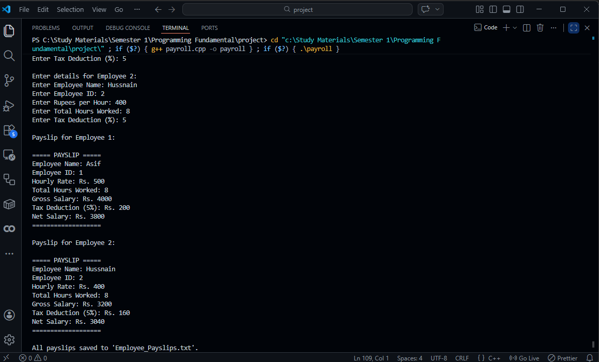
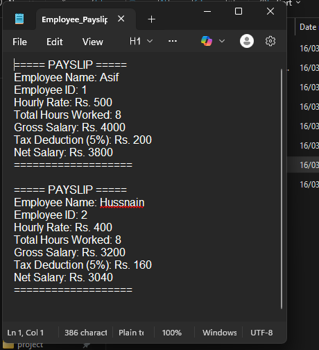

# 💼 Payroll System

A simple yet powerful **console-based Payroll Management System** written in **C++** that automates employee salary calculations and payslip generation.

> **Developed by:** Muhammad Asif & Abdul Rahman

---

## 📸 Demo

### Program Output


### Generated Payslip


---

## ✨ Features

- 👤 **Multi-employee support** — process up to 10 employees in a single run
- 🧮 **Automatic salary calculation** — computes gross salary from hourly rate × hours worked
- 🧾 **Tax deduction** — applies a configurable percentage-based tax deduction per employee
- 📋 **On-screen payslip display** — formatted payslip printed directly to the console
- 💾 **File export** — all payslips are automatically saved to `Employee_Payslips.txt` in append mode

---

## 🛠️ Technologies Used

| Technology | Purpose |
|---|---|
| C++ (C++11 or later) | Core language |
| `<iostream>` | Console I/O |
| `<iomanip>` | Output formatting |
| `<fstream>` | File handling |
| `<string>` | String management |

---

## 📂 Project Structure

```
payroll_system/
├── payroll.cpp           # Main source file
├── payroll.exe           # Pre-built Windows executable
├── Employee_Payslips.txt # Auto-generated payslip output file
├── preview_output.png    # Screenshot – program running in terminal
└── payslip.png           # Screenshot – sample payslip output
```

---

## 🚀 Getting Started

### Prerequisites

- A C++ compiler supporting **C++11** or later (e.g., `g++`, `clang++`, MSVC)

### Build

```bash
# Using g++ (Linux / macOS / Windows with MinGW)
g++ -std=c++11 -o payroll payroll.cpp

# Or on Windows with MSVC
cl /EHsc payroll.cpp /Fe:payroll.exe
```

### Run

```bash
# Linux / macOS
./payroll

# Windows
payroll.exe
```

---

## 📖 Usage

1. **Launch** the program.
2. **Enter** the number of employees you want to process (1–10).
3. For **each employee**, provide:
   - Full name
   - Employee ID
   - Hourly rate (in Rupees)
   - Total hours worked
   - Tax deduction percentage
4. The program will **display** a formatted payslip for every employee.
5. All payslips are **automatically saved** to `Employee_Payslips.txt`.

### Example Session

```
=== Payroll System ===
Enter the number of employees (max 10): 1

Enter details for Employee 1:
Enter Employee Name: Asif
Enter Employee ID: 1
Enter Rupees per Hour: 500
Enter Total Hours Worked: 8
Enter Tax Deduction (%): 5

Payslip for Employee 1:

===== PAYSLIP =====
Employee Name: Asif
Employee ID: 1
Hourly Rate: Rs. 500
Total Hours Worked: 8
Gross Salary: Rs. 4000
Tax Deduction (5%): Rs. 200
Net Salary: Rs. 3800
===================

All payslips saved to 'Employee_Payslips.txt'.
```

---

## 🧮 Salary Calculation

| Term | Formula |
|---|---|
| **Gross Salary** | `Hourly Rate × Total Hours Worked` |
| **Tax Amount** | `Gross Salary × (Tax % ÷ 100)` |
| **Net Salary** | `Gross Salary − Tax Amount` |

---

## 📄 License

This project is intended for educational purposes.

---

## 🤝 Authors

- **Muhammad Asif**
- **Abdul Rahman**
